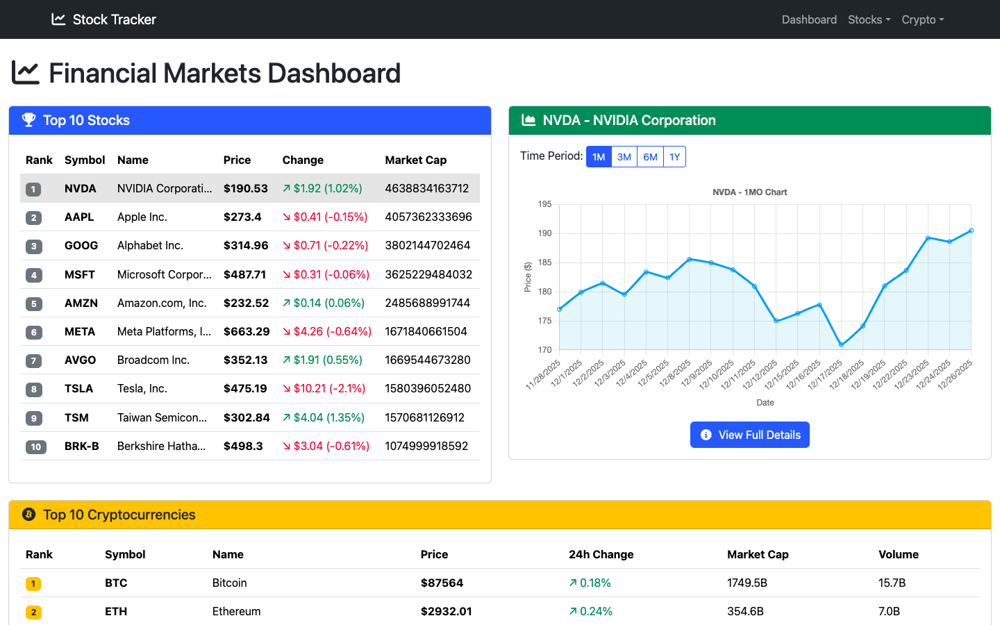

# Stock and Crypto Tracker

[](#-license)
[](#-tech-stack)
[](#-tech-stack)
[](#-tech-stack)
[](#-tech-stack)

A full-featured web application for tracking stock and cryptocurrency prices in real-time. Built as a CS50 Final Project.

> [!CAUTION]  
> Because a CoinGecko API rate limit for crypto, the crypto feature ara may not working correctly because it is simply cannot fetch data from CoinGecko API.  
> **See [Known Limitations](#-known-limitations) for more details.**

---

## 📋 Table of Contents

- [📖 Project Overview](#-project-overview)
- [✨ Features](#-features)
- [🛠 Tech Stack](#-tech-stack)
- [📁 Project Structure](#-project-structure)
- [🚀 Installation](#-installation)
- [⚙️ Configuration](#-configuration)
- [📚 API Documentation](#-api-documentation)
- [💻 Usage](#-usage)
- [🏗 Architecture](#-architecture)
- [🧪 Testing](#-testing)
- [🔧 Implementation Details](#-implementation-details)
- [🚢 Deployment](#-deployment)
- [⚠️ Known Limitations](#-known-limitations)
- [📄 License](#-license)
- [👨‍💻 Author](#-author)
- [🙏 Acknowledgments](#-acknowledgments)

---

## 📖 Project Overview

#### Repository: [`DanyilT/stock-and-crypto-tracker-web-app`](https://github.com/DanyilT/stock-and-crypto-tracker-web-app)
#### Project Demo: [danyilt.pythonanywhere.com](https://danyilt.pythonanywhere.com) *(if its even still there)*
#### Video Demo: [YouTube Link](https://youtu.be/5XCw6tz7zmo)

---
#### Description:
A full\-featured web application that tracks stock and cryptocurrency prices in near real\-time. The project provides a Flask\-based backend with a modular service layer for data retrieval, caching, and validation, and a vanilla JavaScript frontend organized into core components, feature modules, loaders, and utilities. Stocks are powered by `yfinance` and a web\-scraped list of popular tickers, while crypto data integrates with the _CoinGecko API_. The app includes dynamic pages for _listings_, _charts_, _detail views_, _watchlists_, _error handling_, and _notifications_, with responsive _Jinja2 templates_ and _Bootstrap styling_.

This project began as a **CS50 Final Project** with the goals of building a full stack web application, adhering to good software design practices, and providing a clear user experience for tracking financial assets. On the backend, the application follows the Application Factory pattern for clean initialization, a clear separation of concerns via a Service Layer, and centralized error handling middleware. On the frontend, it uses a component\-based architecture without heavy frameworks, focusing on reusable modules and clean API wrappers. Across both sides, consistent validation, caching, and rate\-limit safeguards ensure stability under real\-world conditions.

From the outset, several design choices were carefully considered. First, the decision to use `yfinance` for stock data was driven by ease of integration and breadth of endpoints, despite its free\-tier limitations and occasional delays. For cryptocurrencies, CoinGecko’s public API provided sufficient coverage but imposed strict rate limits; this led to the implementation of two\-minute cache windows, stale\-cache fallbacks, and constrained request intervals in the crypto service. Second, the web scraping of popular stocks from CompaniesMarketCap was chosen to avoid paid data sources; this introduced fragility on hosts like PythonAnywhere where scraping can be blocked, so a hardcoded fallback list was added to maintain functionality. Third, the frontend was intentionally built with vanilla JavaScript and Bootstrap to reduce complexity and avoid framework overhead, favoring understandable modules and testable utilities.

The repository is structured with clear boundaries between layers. The `app.py` file provides the Application Factory `create_app()` that loads `Config`, registers routes, and sets up error handlers. Configuration lives in `config.py`, defining cache durations, valid time periods and intervals, allowed crypto history ranges, and exchange identifiers for market status. The `api/` directory contains route registrations in `api/routes/__init__.py`, and separate handlers in `api/routes/stocks.py`, `api/routes/crypto.py`, and `api/routes/pages.py`. Errors are centralized in `api/middleware/error_handlers.py`, including custom responses (like the 418 “I’m a teapot” Easter egg) with JSON payloads suitable for the frontend.

Business logic resides in `services/`. `services/stock_service.py` handles symbol search, real\-time quotes, historical data (including OHLC for candlesticks), splits, dividends, financial statements, options chains, and related news. It optimizes requests by supporting a “full data” mode when detailed company info is needed and leverages caching for popular stocks. `services/crypto_service.py` integrates with CoinGecko for listings, details, and history, applying strict rate\-limit awareness and two\-minute caching to prevent throttling. `services/cache_service.py` provides time\-based cache invalidation, stale fallback behavior when upstream calls fail, and scraping of popular stock symbols when allowed. The `utils/validators.py` module enforces input hygiene across endpoints: validating periods, intervals, dates, crypto day ranges, and clamping list sizes to configured maximums.

Templates in `templates/` use Jinja2 inheritance and partials for consistency. `base.html` defines the global layout, navigation, footer, notification container, and consent UI. Pages include `index.html` for the dashboard with top stocks and cryptos, `stocks.html` and `crypto.html` for listings with search and watchlists, chart pages (`stocks_chart.html` and `crypto_chart.html`) for interactive time series, and detail pages (`stock_detail.html` and `crypto_detail.html`) with fundamentals and context. Reusable partials like `asset_table.html`, `asset_chart.html`, `stocks_table.html`, `crypto_table.html`, and `search_bar.html` enable uniform rendering and reduce duplication.

Static assets in `static/js/` follow a modular vanilla JS structure. Stock modules include core components like `StocksTable.js`, `StocksWatchlistManager.js`, and `StockChart.js`; feature modules such as `StockSearch.js`, `StockActions.js`, `StockActionButton.js`, and `MarketStatusBanner.js`; loaders like `PopularStocksLoader.js`, `WatchlistLoader.js`, and `TableLoader.js`; and utilities including `StockAPI.js`, `StockFormatters.js`, `MarketTradingHours.js`, `StockHelpers.js`, `PageHelpers.js`, `AssetChart.js`, `ChartHelpers.js`, and `StockTab.js`. Crypto modules mirror this organization with `CryptoTable.js`, `CryptoWatchlistManager.js`, `CryptoSearch.js`, `CryptoActions.js`, `PopularCryptoLoader.js`, `WatchlistCryptoLoader.js`, `CryptoDetailPage.js`, `ChartPage.js`, `CryptoAPI.js`, and `CryptoFormatters.js`. Shared notifications are provided by `utils/NotificationManager.js`, enabling consistent toast messages for success, warnings, and errors.

The API surface is organized and documented to keep clients simple. Stock endpoints cover search, popular lists, symbols, individual quotes and details, history (with period/interval/ohlc options), splits, dividends, financials, holders, options, and related news. Crypto endpoints provide search, popular lists, individual details, and history with day/interval options. Page routes render the dashboard, stock and crypto sections, charts, terms, and a playful `brew-coffee` route mapped to HTTP 418.

In terms of testing and quality, `tests/test_validators.py` verifies all validators for boundaries, formats, and allowed sets. While business logic could be extended with more unit tests, validator coverage ensures that external inputs are sanitized before hitting services, reducing error rates and inconsistent responses. The caching strategy prioritizes user experience: popular stocks cache for one hour to reduce scraping load, crypto data for two minutes to avoid CoinGecko throttling, and stale fallbacks to keep pages responsive when upstream calls fail.

Deployment considerations include local development via Flask’s CLI, production with Gunicorn on Linux/macOS, and a Dockerized setup using `python:3.11\-slim`, exposing port 8000 and running `gunicorn` with multiple workers. On PythonAnywhere, the WSGI app loads via `create_app()`, and a note is included regarding scraping restrictions; popular stocks may be hardcoded there as a contingency.

In summary, this project focuses on a clean, testable architecture across backend and frontend, robust validation and caching, and a responsive UI with practical features like watchlists, charts, and market status. Where APIs impose limits or free tiers add delays, the design incorporates fallbacks and clear user notifications. The result is a pragmatic, maintainable tracker for both stocks and cryptocurrencies that demonstrates thoughtful engineering decisions at every layer.



#### Progress Checklist
- [x] Stocks
  - [x] Backend implementation
  - [x] Frontend implementation
  - [x] Integration and testing
- [x] Crypto
  - [x] Backend implementation
  - [x] Frontend implementation
  - [x] Integration and testing

---

## ✨ Features

### Stock Tracking
- **Real-time Stock Data**: Fetch live stock prices using Yahoo Finance API
- **Popular Stocks**: Display top stocks by market capitalization (scraped from CompaniesMarketCap)
- **Stock Search**: Search any stock by symbol
- **Historical Charts**: Interactive price charts with customizable time periods and intervals
- **Stock Details**: Comprehensive stock information including:
  - Price, change, and percentage change
  - Market cap, volume, and average volume
  - P/E ratio, EPS, dividend yield, beta
  - 52-week high/low
  - Sector, industry, and company description
- **Financial Data**: Access to income statements, balance sheets, cash flow statements
- **Additional Data**: Stock splits, dividend history, institutional holders, options data, news
- **Market Status**: Real-time US and EU market open/close status indicators
- **Watchlist**: Save favorite stocks to a personal watchlist (stored in localStorage)

### Cryptocurrency Tracking
- **Real-time Crypto Data**: Fetch live cryptocurrency prices via CoinGecko API
- **Top Cryptocurrencies**: Display top cryptos by market cap
- **Crypto Search**: Search cryptocurrencies by name or symbol
- **Historical Charts**: Interactive price charts with customizable time periods
- **Crypto Details**: Comprehensive cryptocurrency information including:
  - Current price and 24h/7d/30d/1y price changes
  - Market cap, volume, circulating and total supply
  - All-time high (ATH) and all-time low (ATL) with dates
  - Descriptions, categories, and links
- **Crypto Watchlist**: Save favorite cryptocurrencies to a personal watchlist

### UI/UX Features
- **Responsive Design**: Bootstrap-based responsive layout
- **Dark Navigation**: Modern dark-themed navigation bar
- **Loading States**: Spinner indicators during data fetches
- **Error Handling**: Graceful error messages and fallbacks
- **Notifications**: Toast-style notifications for user actions
- **Cookie Consent**: GDPR-compliant consent management for localStorage usage
- **Auto-refresh**: Optional automatic data refresh functionality
- **Meme Errors: Use memegen.link API to generate ~~fun~~ memes for error pages (e.g., 418 I'm a teapot)**

---

## 🛠 Tech Stack

### Backend
- **Python 3.x** - Core programming language
- **Flask** - Lightweight web framework
- **Jinja2** - Templating engine for dynamic HTML rendering
- **yfinance** - Yahoo Finance API wrapper for stock data
- **BeautifulSoup4** - Web scraping for popular stocks list
- **Requests** - HTTP client for API calls
- **Pandas** - Data manipulation and processing

### Frontend
- **HTML5/CSS3** - Markup and styling
- **JavaScript (ES6+)** - Client-side interactivity
- **Bootstrap 5** - CSS framework for responsive design
- **Chart.js** - Interactive charts and graphs
- **Font Awesome** - Icon library

### APIs Used
- **Yahoo Finance** (via yfinance) - Stock data, quotes, historical data (python library)
- **CoinGecko API** - Cryptocurrency data (free tier)
- **CompaniesMarketCap.com** - Popular stocks by market cap (web scraping)
- **Memegen.link** - Meme generation for fun error pages

---

## 📁 Project Structure

```
├── app.py                      # Application entry point & factory
├── config.py                   # Configuration settings
├── requirements.txt            # Python dependencies
├── README.md                   # Project documentation
├── LICENSE                     # License information
│
├── api/                        # API layer
│   ├── routes/                 # Route handlers
│   │   ├── __init__.py         # Route registration
│   │   ├── stocks.py           # Stock API endpoints
│   │   ├── crypto.py           # Crypto API endpoints
│   │   └── pages.py            # Page routes
│   └── middleware/
│       └── error_handlers.py   # Error handling middleware
│
├── services/                   # Business logic layer
│   ├── stock_service.py        # Stock data operations
│   ├── crypto_service.py       # Crypto data operations
│   └── cache_service.py        # Caching service
│
├── utils/                      # Utility functions
│   └── validators.py           # Input validation
│
├── templates/                  # Jinja2 HTML templates
│   ├── base.html               # Base template with navbar/footer
│   ├── index.html              # Dashboard page
│   ├── stocks.html             # Stocks listing page
│   ├── stocks_chart.html       # Stock chart page
│   ├── stock_detail.html       # Individual stock page
│   ├── crypto.html             # Crypto listing page
│   ├── crypto_chart.html       # Crypto chart page
│   ├── crypto_detail.html      # Individual crypto page
│   ├── terms.html              # Terms and Conditions page
│   └── partials/               # Reusable template components
│       ├── asset_table.html
│       ├── asset_chart.html
│       ├── stocks_table.html
│       ├── crypto_table.html
│       └── search_bar.html
│
├── static/                     # Static assets
│   ├── favicon_io/             # Favicon files
│   └── js/
│       ├── utils/              # Shared utilities
│       │   └── NotificationManager.js
│       ├── stocks/             # Stock-related JavaScript
│       │   ├── core/           # Core components
│       │   │   ├── StocksTable.js
│       │   │   ├── StocksWatchlistManager.js
│       │   │   └── StockChart.js
│       │   ├── features/       # Feature modules
│       │   │   ├── StockSearch.js
│       │   │   ├── StockActions.js
│       │   │   ├── StockActionButton.js
│       │   │   └── MarketStatusBanner.js
│       │   ├── loaders/        # Data loading components
│       │   │   ├── PopularStocksLoader.js
│       │   │   ├── WatchlistLoader.js
│       │   │   └── TableLoader.js
│       │   ├── pages/          # Page-specific logic
│       │   │   ├── ChartPage.js
│       │   │   └── StockDetailPage.js
│       │   └── utils/          # Stock utilities
│       │       ├── StockAPI.js
│       │       ├── StockFormatters.js
│       │       ├── MarketTradingHours.js
│       │       ├── StockHelpers.js
│       │       ├── PageHelpers.js
│       │       ├── AssetChart.js
│       │       ├── ChartHelpers.js
│       │       └── StockTab.js
│       └── crypto/             # Crypto-related JavaScript
│           ├── core/
│           │   ├── CryptoTable.js
│           │   └── CryptoWatchlistManager.js
│           ├── features/
│           │   ├── CryptoSearch.js
│           │   └── CryptoActions.js
│           ├── loaders/
│           │   ├── PopularCryptoLoader.js
│           │   └── WatchlistCryptoLoader.js
│           ├── pages/
│           │   ├── ChartPage.js
│           │   └── CryptoDetailPage.js
│           └── utils/
│               ├── CryptoAPI.js
│               └── CryptoFormatters.js
│
└── tests/                      # Test suite
    └── test_validators.py      # Validator unit tests
```

---

## 🚀 Installation

> [!TIP]  
> Project demo is hosted on PythonAnywhere:
> [danyilt.pythonanywhere.com](https://danyilt.pythonanywhere.com) *(if its even still there)*  
> ***Note:** Because of PythonAnywhere is blocking web scraping, the popular stocks list may not load correctly there.*

### Prerequisites
- Python 3.8 or higher
- pip (Python package manager)
- Git

### Steps

1. **Clone the repository**
   ```bash
   git clone https://github.com/DanyilT/stock-and-crypto-tracker-web-app.git
   cd stock-and-crypto-tracker-web-app
   ```

2. **Create a virtual environment** (recommended)
   ```bash
   python -m venv venv
   
   # On macOS/Linux
   source venv/bin/activate
   
   # On Windows
   venv\Scripts\activate
   ```

3. **Install dependencies**
   ```bash
   pip install -r requirements.txt
   ```

4. **Run the application**
   ```bash
   flask run
   ```

5. **Access the application**
   Open your browser and navigate to: `http://127.0.0.1:5000`

---

## ⚙️ Configuration

Configuration options are defined in `config.py`:

| Setting | Default | Description |
|---------|---------|-------------|
| `CACHE_DURATION` | 3600 (1 hour) | Stock cache duration in seconds |
| `CRYPTO_CACHE_DURATION` | 120 (2 min) | Crypto cache duration (respects rate limits) |
| `MAX_TOP_STOCKS` | 100 | Maximum popular stocks to fetch |
| `DEFAULT_TOP_STOCKS` | 10 | Default number of popular stocks |
| `MAX_TOP_CRYPTOS` | 100 | Maximum popular cryptos to fetch |
| `DEFAULT_TOP_CRYPTOS` | 10 | Default number of popular cryptos |
| `REQUEST_TIMEOUT` | 10 | HTTP request timeout in seconds |
| `VALID_PERIODS` | [...] | Valid time periods for historical data |
| `VALID_INTERVALS` | [...] | Valid intervals for historical data |
| `VALID_CRYPTO_DAYS` | [...] | Valid day ranges for crypto history |
| `US_EXCHANGES` | [...] | US stock exchange identifiers |
| `EU_EXCHANGES` | [...] | EU stock exchange identifiers |

---

## 📚 API Documentation

### Stock Endpoints

| Endpoint | Method | Description | Parameters |
|----------|--------|-------------|------------|
| `/api/stocks/search` | GET | Search stocks by symbol | `q` (query) |
| `/api/stocks/popular` | GET | Get top stocks by market cap | `top` (default: 10) |
| `/api/stocks/popular/list` | GET | Get popular stock symbols | `top`, `symbols-only` |
| `/api/stock/<symbol>` | GET | Get individual stock data | `full-data` |
| `/api/stock/<symbol>/history` | GET | Get historical data | `period`, `start`, `end`, `interval`, `ohlc`, `data-only` |
| `/api/stock/<symbol>/quote` | GET | Get real-time quote | - |
| `/api/stock/<symbol>/splits` | GET | Get stock split history | - |
| `/api/stock/<symbol>/dividends` | GET | Get dividend history | `period` |
| `/api/stock/<symbol>/financials` | GET | Get financial statements | `type`, `quarterly` |
| `/api/stock/<symbol>/holders` | GET | Get institutional holders | - |
| `/api/stock/<symbol>/options` | GET | Get options data | `expiration` |
| `/api/stock/<symbol>/news` | GET | Get related news | `limit` |

### Crypto Endpoints

| Endpoint | Method | Description | Parameters |
|----------|--------|-------------|------------|
| `/api/crypto/search` | GET | Search cryptocurrencies | `q` (query) |
| `/api/crypto/popular` | GET | Get top cryptos by market cap | `top` (default: 10) |
| `/api/crypto/popular/list` | GET | Get popular crypto symbols | `top`, `symbols-only` |
| `/api/crypto/<crypto_id>` | GET | Get individual crypto data | `full-data` |
| `/api/crypto/<crypto_id>/history` | GET | Get historical data | `days`, `interval` |

### Page Routes

| Route | Description |
|-------|-------------|
| `/` | Dashboard with top stocks and cryptos |
| `/stocks` | Stocks listing with search and watchlist |
| `/stocks/chart` | Stock chart visualization |
| `/stocks/<symbol>` or `/stock/<symbol>` | Individual stock detail page |
| `/crypto` | Crypto listing with search and watchlist |
| `/crypto/chart` | Crypto chart visualization |
| `/crypto/<crypto_id>` | Individual crypto detail page |
| `/terms` | Terms and Conditions page |
| `/brew-coffee` | I'm a teapot |

### Example API Requests

```bash
# Get Apple stock data
curl http://localhost:5000/api/stock/AAPL

# Get full stock data with company details
curl http://localhost:5000/api/stock/AAPL?full-data

# Get 3-month historical data
curl "http://localhost:5000/api/stock/AAPL/history?period=3mo&interval=1d"

# Get OHLC data for candlestick charts
curl "http://localhost:5000/api/stock/AAPL/history?period=1mo&ohlc"

# Get top 20 popular stocks
curl http://localhost:5000/api/stocks/popular?top=20

# Search for Bitcoin
curl http://localhost:5000/api/crypto/search?q=bitcoin

# Get Ethereum data
curl http://localhost:5000/api/crypto/ethereum?full-data
```

---

## 💻 Usage

### Dashboard
The home page displays:
- Top 10 stocks by market capitalization
- Interactive chart area (click any asset to view)
- Top 10 cryptocurrencies

### Stock Tracking
1. Navigate to **Stocks** → **Popular Stocks**
2. Browse top stocks or use the search bar
3. Click any stock to view details or chart
4. Add stocks to your watchlist using the ⭐ button
5. Switch between Popular and Watchlist tabs

### Crypto Tracking
1. Navigate to **Crypto** → **Popular Crypto**
2. Browse top cryptocurrencies or search
3. Click any crypto for detailed view
4. Manage your crypto watchlist

### Charts
- Select time periods: 1D, 5D, 1M, 3M, 6M, 1Y, etc.
- View price and volume data
- OHLC candlestick charts available

---

## 🏗 Architecture

### Design Patterns

**Application Factory Pattern** [[app.py]](app.py)
```python
def create_app():
    app = Flask(__name__)
    app.config.from_object(Config)
    register_routes(app)
    register_error_handlers(app)
    return app
```

**Service Layer Pattern**
- `StockService`: Handles all stock data operations
- `CryptoService`: Handles all cryptocurrency operations
- `CacheService`: Manages caching for API responses

**Modular Frontend Architecture**
```
js/stocks/
├── core/       # Core components (Table, WatchlistManager, Chart)
├── features/   # Feature modules (Search, Actions, Buttons)
├── loaders/    # Data loading logic
├── pages/      # Page-specific initialization
└── utils/      # Utility functions and API wrappers
```

### Data Flow
1. **User Request** → Flask Route Handler
2. **Route Handler** → Service Layer
3. **Service Layer** → External API/lib (yfinance/CoinGecko) or Cache
4. **Response** → JSON API or Rendered Template
5. **Frontend** → Fetch API → DOM Update

### Caching Strategy
- Popular stocks list cached for 1 hour
- Cryptocurrency data cached for 2 minutes
- Cache invalidation on stale data with fallback

---

## 🧪 Testing

Run the test suite:

```bash
# Install pytest if not already installed
pip install pytest

# Run all tests
pytest

# Run with verbose output
pytest -v

# Run specific test file
pytest tests/test_validators.py

# (if got an import error) Run with PYTHONPATH='current_directory'
PYTHONPATH=. pytest tests/test_validators.py
```

### Test Coverage
- Input validation tests for all validators
- Period and interval validation
- Date format validation
- Boundary condition testing

---

## 🔧 Implementation Details

### Backend Implementation

#### Application Factory Pattern
The project uses Flask's application factory pattern (`create_app()`) for better testability and flexibility: [[app.py]](app.py)
```python
def create_app():
    app = Flask(__name__)
    app.config.from_object(Config)
    register_routes(app)
    register_error_handlers(app)
    return app
```

#### Service Layer Architecture
Business logic is separated into dedicated service classes:

**StockService** (`services/stock_service.py`):
- Fetches stock data via `yfinance` library
- Provides basic and full data modes for performance optimization
- Handles historical data with OHLC support for candlestick charts
- Implements real-time quote fetching, financial statements, dividends, splits
- Supports US and EU market detection based on exchange identifiers

**CryptoService** (`services/crypto_service.py`):
- Integrates with CoinGecko REST API
- Implements rate-limit-aware caching (2-minute cache)
- Provides search functionality and detailed coin information
- Handles historical price data with automatic interval selection

**CacheService** (`services/cache_service.py`):
- Web scrapes CompaniesMarketCap.com for popular stock symbols
- Implements time-based cache invalidation
- Provides stale cache fallback when API requests fail

#### Route Registration Pattern
Routes are modularly organized and registered via a central function: [[api/routes/\__init\__.py]](api/routes/__init__.py)
```python
def register_routes(app):
    register_page_routes(app)       # HTML page routes
    register_stock_routes(app)      # Stock API endpoints
    register_crypto_routes(app)     # Crypto API endpoints
```

#### Error Handling Middleware
Centralized error handling with custom handlers for HTTP errors: [[api/middleware/error_handlers.py]](api/middleware/error_handlers.py)
```python
@app.errorhandler(418)
def im_a_teapot(error):
    return jsonify({'error': 'I\'m a teapot', 'meme': 'https://api.memegen.link/...'}), 418
```

#### Input Validation
The [`validators.py`](utils/validators.py) module provides validation functions:
- `validate_top_stocks_count()` - Validates and clamps count parameters
- `validate_period()` - Validates time period strings
- `validate_interval()` - Validates data interval strings  
- `validate_date_format()` - Validates YYYY-MM-DD date format
- `validate_crypto_days()` - Validates crypto history day ranges

### Frontend Implementation

#### Modular JavaScript Architecture
The frontend uses a component-based vanilla JavaScript architecture:

**Core Components**:
- `StocksTable` / `CryptoTable` - Renders data tables with dynamic content
- `StocksWatchlistManager` / `CryptoWatchlistManager` - Manages localStorage watchlists with consent

**Feature Modules**:
- `StockSearch` / `CryptoSearch` - Handles search input and results
- `StockActions` / `CryptoActions` - Manages button click handlers
- `StockActionButton` - Factory for creating consistent action buttons
- `MarketStatusBanner` - Displays real-time US/EU market status

**Loaders**:
- `PopularStocksLoader` / `PopularCryptoLoader` - Fetches and displays popular assets
- `WatchlistLoader` / `WatchlistCryptoLoader` - Loads watchlist data from localStorage

**Utilities**:
- `StockAPI` / `CryptoAPI` - Unified API request functions with endpoint configurations
- `StockFormatters` / `CryptoFormatters` - Formatting functions for prices, market caps, changes
- `MarketTradingHours` - Calculates market open/close status

#### Notification System
Toast-style notifications with automatic dismissal:
```javascript
showNotification('Stock added to watchlist', 'success', { timeout: 1000 });
```

#### GDPR-Compliant Consent Management
The watchlist manager implements a two-tier consent system:
1. General localStorage/cookie consent
2. Specific watchlist feature consent

#### Template System
Uses Jinja2 template inheritance and macros:
- `base.html` - Base layout with navbar, footer, notification container
- `partials/*.html` - Reusable components (tables, search bars, charts)
- Page templates extend base and import partials

---

## 🚢 Deployment

### Local Development

```bash
# Run in development mode with auto-reload
python app.py

# Or using Flask CLI
export FLASK_APP=app.py
export FLASK_ENV=development
flask run
```

### Production Deployment

#### Option 1: Gunicorn (Recommended for Linux/macOS)

```bash
# Install Gunicorn
pip install gunicorn

# Run with Gunicorn (4 workers)
gunicorn -w 4 -b 0.0.0.0:8000 "app:create_app()"

# With logging
gunicorn -w 4 -b 0.0.0.0:8000 --access-logfile access.log --error-logfile error.log "app:create_app()"
```

#### Option 2: Docker

Create a `Dockerfile`:
```dockerfile
FROM python:3.11-slim

WORKDIR /app

COPY requirements.txt .
RUN pip install --no-cache-dir -r requirements.txt
RUN pip install gunicorn

COPY . .

EXPOSE 8000

CMD ["gunicorn", "-w", "4", "-b", "0.0.0.0:8000", "app:create_app()"]
```

Build and run:
```bash
docker build -t stock-tracker .
docker run -p 8000:8000 stock-tracker
```

#### Option 3: PythonAnywhere (Free Hosting) / Or any other similar PaaS

1. Create a free account at [pythonanywhere.com](https://www.pythonanywhere.com/)
2. Upload your project files or clone from GitHub - `git clone`
3. Create a new Web app with Flask
4. Set the WSGI configuration file:
   ```python
   import sys
   path = '/home/yourusername/stock-tracker'
   if path not in sys.path:
       sys.path.append(path)
   
   from app import create_app
   application = create_app()
   ```
5. Install dependencies via Bash console:
   ```bash
   pip install -r requirements.txt
   ```

> [!TIP]  
> I am hosting the demo of this project on PythonAnywhere:  
> [danyilt.pythonanywhere.com](https://danyilt.pythonanywhere.com)
> *(if its even still there)*  

---

## ⚠️ Known Limitations

### CoinGecko API Rate Limits
> **Important**: The free tier of CoinGecko API has strict rate limits (~30 requests/minute). The cryptocurrency features may not work correctly if the rate limit is exceeded.

**Mitigations implemented:**
- 2-minute cache for crypto data
- Stale cache fallback on rate limit errors
- Error handling with user notifications

### Other Limitations
- Stock data is delayed (used Yahoo Finance free tier)
- Some stock symbols may not be available in yfinance
- Web scraping for popular stocks depends on CompaniesMarketCap.com structure: *web scraping is not working on PythonAnywhere due to their restrictions, so i hardcoded the popular stocks list there for this case.*

---

## 📄 License

This project is licensed under the [MIT License](https://opensource.org/license/MIT). See the [LICENSE](LICENSE) file for details.

---

## 👨‍💻 Author

[**DanyilT**](https://github.com/DanyilT) — CS50 Final Project

---

## 🙏 Acknowledgments

- [CS50](https://cs50.harvard.edu/) - Harvard's Introduction to Computer Science
- [Yahoo Finance](https://finance.yahoo.com/) - Stock data provider
- [CoinGecko](https://www.coingecko.com/) - Cryptocurrency data provider
- [CompaniesMarketCap](https://companiesmarketcap.com/) - Market cap rankings
- [Bootstrap](https://getbootstrap.com/) - CSS framework
- [Chart.js](https://www.chartjs.org/) - Charting library
- [Memegen.link](https://api.memegen.link/) - Meme generation API
